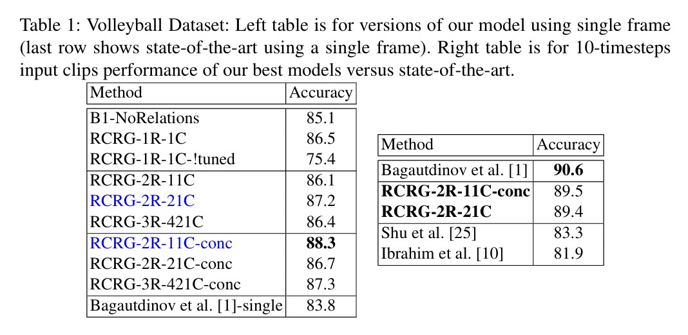
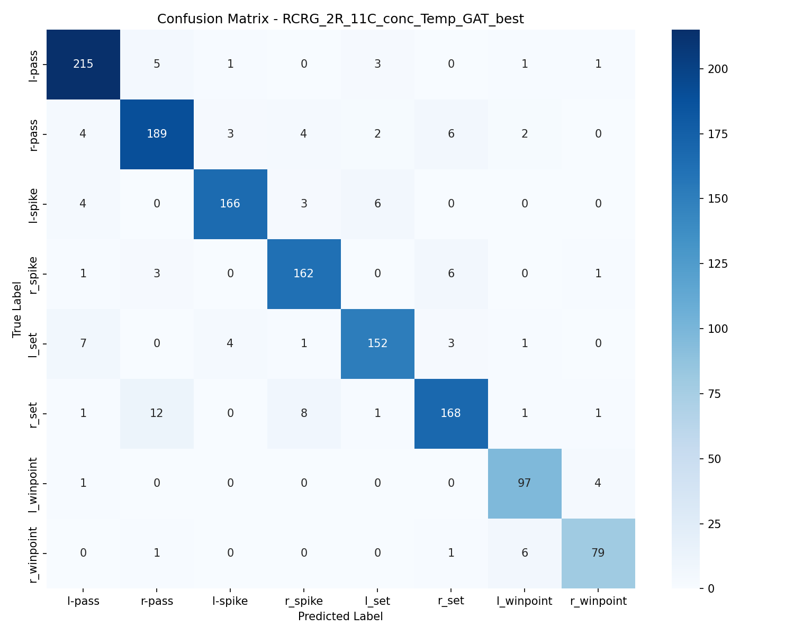

# Hierarchical Relational Networks for Group Activity Recognition

[](https://www.python.org/)
[](https://pytorch.org/)
[](LICENSE)
[](docs/Ibrahim18-eccv-Hierarchical%20-Relational-Networks.pdf)

A PyTorch implementation of **Hierarchical Relational Networks** for Group Activity Recognition, based on the ECCV 2018 paper by Ibrahim & Mori. This implementation extends the original work with modern training practices, ResNet50 backbone, and Graph Attention Networks.

> **Paper:** [Hierarchical Relational Networks for Group Activity Recognition and Retrieval](docs/Ibrahim18-eccv-Hierarchical%20-Relational-Networks.pdf)  
> **Authors:** Mostafa S. Ibrahim and Greg Mori (Simon Fraser University)

## Table of Contents

- [Overview](#overview)
- [Usage](#usage)
- [Installation](#installation)
- [Architecture](#architecture)
- [Results](#results)
- [Dataset](#dataset)
- [Model Variants](#model-variants)
- [Configuration](#configuration)
- [Project Structure](#project-structure)

## Overview

This project addresses the challenge of understanding collective behavior from individual person features and their relationships in volleyball game scenarios.

| Aspect | Description |
|--------|-------------|
| **Input** | Video clips (9 frames) with ~12 players |
| **Output** | Group activity classification (8 classes) |
| **Approach** | Hierarchical graph-based relational reasoning |

### Key Features

- **Multi-stage Pipeline** — Person feature extraction → Relational modeling → Temporal modeling
- **ResNet50 Backbone** — Upgraded from VGG19 for improved feature extraction
- **Graph Attention Networks** — Extended implementation with GAT (not in original paper)
- **Distributed Training** — Multi-GPU support with PyTorch DDP and AMP
- **Flexible Graph Structures** — Support for various clique configurations

## Usage

### Pre-trained Model

The best model `RCRG_2R_11C_conc_Temp_GAT` (91.85% accuracy) is available on Kaggle:

```bash
# Download via Kaggle
https://www.kaggle.com/code/mustafamohamed22/rcrg-2r-11c-conc-temp-gat

```

### Quick Start

```python
import torch
from models.person_classifer import Person_Classifer
from models.attention_model.RCRG_2R_11C_conc_Temp_GAT import RCRG_2R_11C_conc_Temp_GAT

# Initialize and load model
person_model = Person_Classifer(num_classes=9)
model = RCRG_2R_11C_conc_Temp_GAT(person_model, num_classes=8)

checkpoint = torch.load('RCRG_2R_11C_conc_Temp_GAT_best.pth', map_location='cuda')
model.load_state_dict(checkpoint['model_state_dict'])
model.eval()
```

### REST API Deployment

```bash
# Install dependencies
pip install fastapi uvicorn python-multipart

# Start FastAPI server
uvicorn deploy.app:app --host 0.0.0.0 --port 8000
```


## Installation

```bash
# Clone repository
git clone https://github.com/HagAli22/Hierarchical-Relational-Group-Activity-Recognition.git
cd hierarchical-relational-network

# Create virtual environment
python -m venv venv
source venv/bin/activate  # Linux/Mac
venv\Scripts\activate     # Windows

# Install dependencies
pip install -r requirements.txt
```

### Requirements

- Python 3.8+
- PyTorch 2.0+
- torchvision 0.15+
- CUDA 11.0+ (for GPU training)

## Architecture

The model processes video clips through three stages:

```
┌─────────────────┐    ┌──────────────────┐    ┌─────────────────┐
│  Person Feature │ -> │    Relational    │ -> │    Temporal     │
│   Extraction    │    │    Modeling      │    │    Modeling     │
│   (ResNet50)    │    │  (Graph Layers)  │    │     (LSTM)      │
└─────────────────┘    └──────────────────┘    └─────────────────┘
```

### Relational Layer

<p align="center">
  
</p>

The relational layer is the core building block. Given K people and a relationship graph G:
- **Input:** K person feature vectors + relationship graph encoding player connections
- **Processing:** Shared neural network F maps connected person pairs to relational representations
- **Aggregation:** Messages from neighbors are summed to create new representations
- **Output:** K relational feature vectors encoding individual features and relationships

### Relational Unit

<p align="center">
  
</p>

Mathematical formulation:
```
P_i^l = Σ F(P_i^(l-1) ⊕ P_j^(l-1); θ)  for all j ∈ neighbors(i)
```

### Complete Pipeline

<p align="center">
  
</p>

| Stage | Operation | Output Dimension |
|-------|-----------|------------------|
| Input | 12 players with CNN features | 2048-D |
| Layer 1 | 4 cliques (3 players each) | 512-D |
| Layer 2 | 2 cliques (teams) | 256-D |
| Layer 3 | 1 clique (all players) | 128-D |
| Pooling | Team-aware max pooling | 256-D |
| Output | Softmax classification | 8 classes |

## Results

### Comparison with Original Paper

<p align="center">
  
</p>
<p align="center"><em>Original ECCV 2018 results (VGG19 backbone, Lasagne framework)</em></p>

### My Scores

#### Stage 1: Person Action Classification

| Model | Backbone | Accuracy |
|-------|----------|----------|
| Person Classifier | ResNet50 | **80.95%** |

#### Stage 2: Non-Temporal Models

| Model | Paper | Ours | Δ |
|-------|-------|------|---|
| B1-NoRelations | 85.1% | **90.06%** | +4.96% |
| RCRG-1R-1C | 86.5% | **90.82%** | +4.32% |
| RCRG-2R-11C | 86.1% | **90.28%** | +4.18% |
| RCRG-2R-11C-conc | 88.3% | **90.15%** | +1.85% |
| RCRG-2R-21C | 87.2% | **90.54%** | +3.34% |
| RCRG-3R-421C | 86.4% | **89.97%** | +3.57% |

#### Stage 3: Temporal Models

| Model | Paper | Ours | Δ |
|-------|-------|------|---|
| RCRG-2R-11C-conc-Temporal | 89.5% | **91.02%** | +1.52% |
| RCRG-2R-21C-Temporal | 89.4% | **91.32%** | +1.92% |

#### Extended: Attention Models (Our Contribution)

| Model | Accuracy |
|-------|----------|
| RCRG-2R-21C-GAT | **90.92%** |
| RCRG-2R-11C-conc-Temp-GAT | **91.85%** ⭐ |

---

### Best Model: RCRG-2R-11C-conc-Temp-GAT

Our best performing model combines Graph Attention Networks with temporal LSTM modeling, achieving **91.85%** accuracy on the test set.


#### Per-Class Performance

| Class | Precision | Recall | F1-Score | Support |
|-------|-----------|--------|----------|---------|
| l-pass | 0.923 | 0.951 | 0.937 | 226 |
| r-pass | 0.900 | 0.900 | 0.900 | 210 |
| l-spike | 0.954 | 0.927 | 0.941 | 179 |
| r-spike | 0.910 | 0.936 | 0.923 | 173 |
| l-set | 0.927 | 0.905 | 0.916 | 168 |
| r-set | 0.913 | 0.875 | 0.894 | 192 |
| l-winpoint | 0.898 | 0.951 | 0.924 | 102 |
| r-winpoint | 0.919 | 0.908 | 0.913 | 87 |
| **Weighted Avg** | **0.919** | **0.919** | **0.918** | **1337** |

#### Confusion Matrix

<p align="center">
  
</p>

The confusion matrix shows strong diagonal dominance with minimal misclassifications. The model performs particularly well on `l-spike` (95.4% precision) and `l-pass` (95.1% recall). Most confusion occurs between similar activities on opposite sides (e.g., `l-set` vs `r-set`).

---

### Key Findings

1. **ResNet50 > VGG19** — Backbone upgrade improved all variants by 2-5%
2. **Relational layers help** — Even 1-layer models outperform the baseline
3. **Temporal modeling matters** — LSTM over 9 frames adds ~1% accuracy
4. **Attention is beneficial** — GAT achieves best results (91.85%)
5. **2 layers is optimal** — 3 layers show diminishing returns


## Dataset

This implementation uses the **Volleyball Dataset** by Ibrahim et al.

| Statistic | Value |
|-----------|-------|
| Total clips | 4,830 |
| Training | 3,493 |
| Testing | 1,337 |
| Group activities | 8 classes |
| Individual actions | 9 classes |
| Frames per clip | 10 |

### Activity Classes

| Class | Description |
|-------|-------------|
| `l-pass` / `r-pass` | Left/Right team passing |
| `l-spike` / `r-spike` | Left/Right team spiking |
| `l-set` / `r-set` | Left/Right team setting |
| `l-winpoint` / `r-winpoint` | Left/Right team wins point |

### Directory Structure

```
volleyball-datasets/
├── videos/
│   └── {video_id}/
│       └── {clip_id}/
│           └── {frame_id}.jpg
└── volleyball_tracking_annotation/
    └── {video_id}/
        └── {clip_id}/
            └── {clip_id}.txt
```


## Model Variants

### Non-Temporal (Single Frame)

| Model | Description |
|-------|-------------|
| `B1-NoRelations` | Baseline without relational reasoning |
| `RCRG-1R-1C` | 1 layer, all players in 1 clique |
| `RCRG-2R-11C` | 2 layers, 1 clique per layer |
| `RCRG-2R-21C` | 2 layers, 2→1 clique structure |
| `RCRG-3R-421C` | 3 layers, 4→2→1 clique hierarchy |
| `*-conc` | Concatenation pooling variant |

### Temporal (Video Sequence)

| Model | Description |
|-------|-------------|
| `RCRG-2R-11C-conc-Temporal` | LSTM over 9 frames |
| `RCRG-2R-21C-Temporal` | 2-clique temporal variant |

### Attention (Extended)

| Model | Description |
|-------|-------------|
| `RCRG-2R-21C-GAT` | Graph Attention Network |
| `RCRG-2R-11C-conc-Temp-GAT` | GAT + Temporal (best) |

## Configuration

Configurations use YAML with dot-notation access:

```yaml
# configs/person_config.yaml
model:
  person_activity:
    backbone: "resnet50"
    num_classes: 9

training:
  person_activity:
    num_epochs: 10
    learning_rate: 7e-4
    optimizer: "adamw"
    use_amp: true

data:
  image_size: 224
  batch_size: 256
```

## Project Structure

```
├── configs/                    # Configuration files
│   ├── config_loader.py        # YAML parser with dot-notation
│   ├── person_config.yaml
│   ├── non_temporal_model/
│   ├── temporal_model/
│   └── attention_model/
│
├── data/                       # Data loading
│   ├── data_loader.py          # Dataset classes
│   ├── volleyball_annot_loader.py
│   ├── boxinfo.py
│   └── load_data.py
│
├── models/                     # Model architectures
│   ├── person_classifer.py     # ResNet50 backbone
│   ├── non_temporal_model/     # Single-frame models
│   ├── temporal_model/         # LSTM models
│   └── attention_model/        # GAT models
│
├── train_all_models/           # Training scripts
│   ├── person_classifier.py
│   ├── non_temporal_model/
│   ├── temporal_model/
│   └── attention_model/
│
├── deploy/                     # Deployment
│   ├── app.py                  # FastAPI server
│   └── inference.py            # Inference pipeline
│
├── docs/                       # Documentation
├── reslutes_and_logs/          # Training logs
└── saved_best_model/           # Checkpoints
```

## Differences from Original Paper

| Aspect | Original | This Implementation |
|--------|----------|---------------------|
| Backbone | VGG19 (4096-D) | ResNet50 (2048-D) |
| Framework | Lasagne | PyTorch 2.0+ |
| Attention | ✗ | GAT models ✓ |
| Training | Single GPU | DDP + AMP |
| Best Accuracy | 89.5% | **91.85%** |

### Our Contributions

- ✅ Full PyTorch re-implementation with modern practices
- ✅ ResNet50 backbone (+2-5% accuracy)
- ✅ Graph Attention Network extension
- ✅ Multi-GPU distributed training (DDP)
- ✅ Automatic Mixed Precision (AMP)
- ✅ TensorBoard logging
